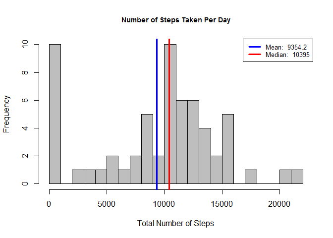
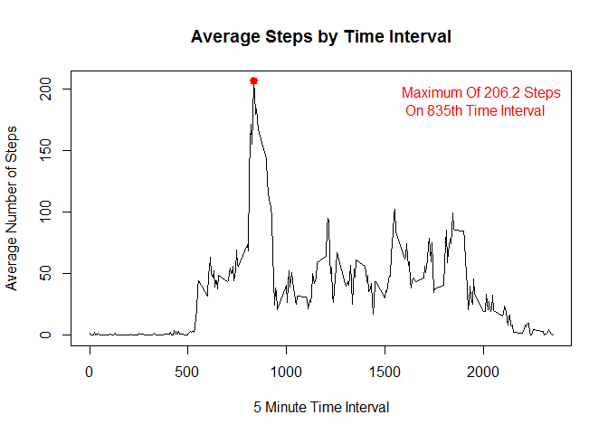
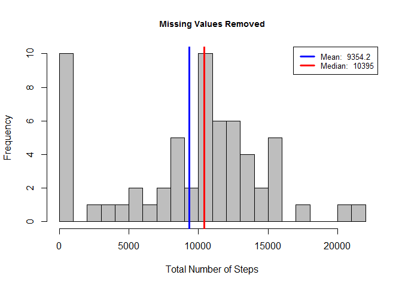
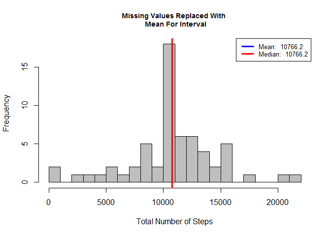

# Reproducible Research: Peer Assessment 1


## Loading and preprocessing the data


```r
totaldata = read.csv('activity.csv', header = T)
```


## What is mean total number of steps taken per day?
###First: summarize data by day

```r
library(data.table)
dat_tbl = data.table(totaldata)
summarydays = dat_tbl[, list(total_steps = sum(steps, na.rm = T)), 
                          by = date]
```

###Create histogram

```r
gen_hist = function(x, title){
        hist(x, 
             breaks = 20,
             main = title,
             xlab = 'Total Number of Steps', col = 'grey',

             cex.main = .9)

        #caluclate mean and median
        mean_value = round(mean(x), 1)
        median_value = round(median(x), 1)

        #place lines for mean and median on histogram
        abline(v=mean_value, lwd = 3, col = 'blue')
        abline(v=median_value, lwd = 3, col = 'red')

        #create legend
        legend('topright', lty = 1, lwd = 3, col = c("blue", "red"),
               cex = .8, 
               legend = c(paste('Mean: ', mean_value),
               paste('Median: ', median_value))
               )
}

gen_hist(summarydays$total_steps, 'Number of Steps Taken Per Day')
```



## What is the average daily activity pattern?


```r
#summarize dataset by interval
summaryinterval = dat_tbl[, list(avg_steps = mean(steps, na.rm = T)), 
                          by = interval]
#plot the time series
with(summaryinterval, {
        plot(interval, avg_steps, type = 'l',
             main = 'Average Steps by Time Interval',
             xlab = '5 Minute Time Interval',
             ylab = 'Average Number of Steps')
        })
#Find Interval That Has The Maximum Avg Steps
maxsteps = summaryinterval[which.max(avg_steps), ]

#Generate Label String
maxlab = paste('Maximum Of ', round(maxsteps$avg_steps, 1), ' Steps \n On ', maxsteps$interval, 'th Time Interval', sep = '')

#Collect Cooridinates of The Max Interval For Graphing
points(maxsteps$interval,  maxsteps$avg_steps, col = 'red', lwd = 3, pch = 19)

#Add Label To Annotate Maximum # Steps And Interval
legend("topright",
       legend = maxlab,
       text.col = 'red',
       bty = 'n'
       )
```




## Imputing missing values


```r
#Join the dataframe created earlier that summarizes the average number of steps per interval to the original dataset
setkey(dat_tbl, interval)
setkey(summaryinterval, interval)

#Create function that will return the second value if the first value is NA
NA_replace = function(x,y){
        if(is.na(x)){

                return(y)
        }
        return(x)
}

#create new dataset that replaces NAs with average values
dat_tbl_miss = dat_tbl[summaryinterval]
dat_tbl_miss$new_steps = mapply(NA_replace,dat_tbl_miss$steps, dat_tbl_miss$avg_steps)

#summaryize new dataset by day
dat_tbl_summary_miss = dat_tbl_miss[, list(new_steps = sum(new_steps, na.rm = T)), 
                          by = date]
#preview new dataset
head(dat_tbl_summary_miss)
```

```
##          date new_steps
## 1: 2012-10-01  10766.19
## 2: 2012-10-02    126.00
## 3: 2012-10-03  11352.00
## 4: 2012-10-04  12116.00
## 5: 2012-10-05  13294.00
## 6: 2012-10-06  15420.00
```

```r
#create histogram
gen_hist(summarydays$total_steps, 'Missing Values Removed')
```



```r
gen_hist(dat_tbl_summary_miss$new_steps, 'Missing Values Replaced With \n Mean For Interval')
```




## Are there differences in activity patterns between weekdays and weekends?

```r
#Make Function To Return Either "Weekday" or "Weekend"
weekpart = function(x){
        if(x %in% c('Saturday', 'Sunday')){
                return('Weekend')
        }

        return('Weekday')
}

#Add Name of Week
dat_tbl_miss$dayname = weekdays(as.Date(dat_tbl_miss$date))

#Add Factor Variable To Differentiate Weekday and Weekend
dat_tbl_miss$daytype = as.factor(apply(as.matrix(dat_tbl_miss$dayname), 1, weekpart))

#Summarize Dataset: Mean grouped by interval and daytype
dat_tbl_summary_miss = dat_tbl_miss[, list(avg_steps = mean(new_steps, na.rm = T)), 
                          by = list(interval, daytype)]

#inspect dataset
str(dat_tbl_summary_miss)
```

```
## Classes 'data.table' and 'data.frame':	576 obs. of  3 variables:
##  $ interval : int  0 0 5 5 10 10 15 15 20 20 ...
##  $ daytype  : Factor w/ 2 levels "Weekday","Weekend": 1 2 1 2 1 2 1 2 1 2 ...
##  $ avg_steps: num  2.2512 0.2146 0.4453 0.0425 0.1732 ...
##  - attr(*, ".internal.selfref")=<externalptr>
```

```r
#Create panel plot
library(lattice)
xyplot(avg_steps~interval | daytype, data = dat_tbl_summary_miss,
      type = 'l',
      xlab = 'Interval',
      ylab = 'Number of Steps',
      layout = c(1,2))
```


